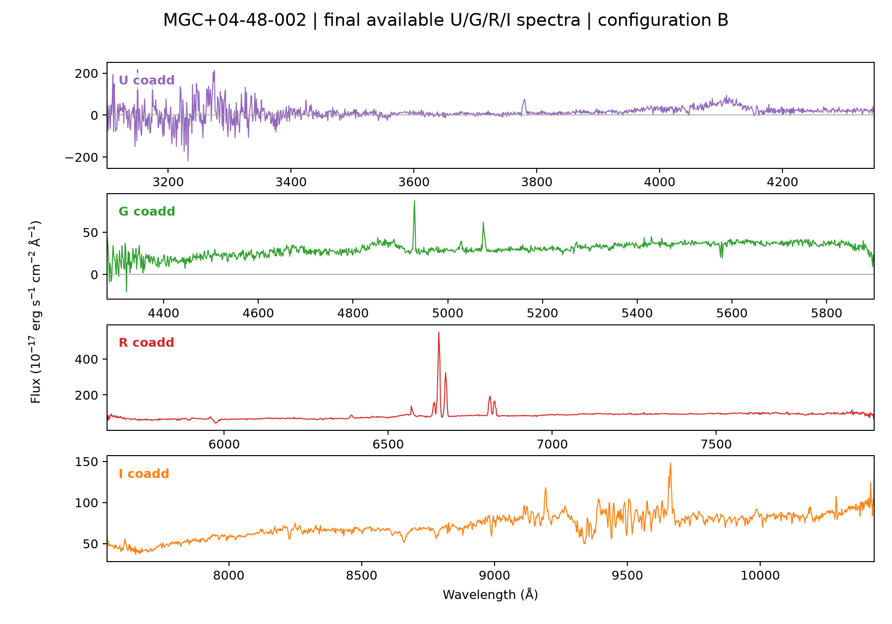

# NGPS / PypeIt reduction workflow

This repository provides a reproducible Palomar/NGPS reduction workflow from
raw FITS files through reviewed extraction, flux calibration, coaddition,
telluric correction of R/I, and final U/G/R/I plots.

The detailed, student-facing procedure is the
[NGPS reduction guide](docs/NGPS_REDUCTION_GUIDE.md). It is the canonical
workflow. This README is a concise reference.

PypeIt is the reduction engine. [`ngps_pipeline`](https://github.com/alessandropeca/ngps_pipeline)
is the operational NGPS wrapper. The official PypeIt project is
[PypeIt](https://github.com/pypeit/PypeIt).

## Install once

Choose your own locations. These are examples only.

```bash
export GITHUB_ROOT="$HOME/Documents/GitHub"
export SOFTWARE_ROOT="$HOME/Software"
export WORKFLOW_ROOT="$GITHUB_ROOT/ngps-pypeit-workflow"
mkdir -p "$GITHUB_ROOT" "$SOFTWARE_ROOT"
git clone https://github.com/alessandropeca/ngps-pypeit-workflow.git "$WORKFLOW_ROOT"
cd "$WORKFLOW_ROOT"
conda env create -f environment.yml
conda activate ngps
git clone https://github.com/cfremling/PypeIt.git "$SOFTWARE_ROOT/PypeIt"
git -C "$SOFTWARE_ROOT/PypeIt" checkout e9ed85c1a237c49626227f4227e323fc390def4b
git clone https://github.com/alessandropeca/ngps_pipeline.git "$SOFTWARE_ROOT/ngps_pipeline"
git -C "$SOFTWARE_ROOT/ngps_pipeline" checkout 55fa9491eb1683769006118c46b26963bbf33ea2
python -m pip install -e "$SOFTWARE_ROOT/PypeIt"
python -m pip install -e "$SOFTWARE_ROOT/ngps_pipeline"
python tools/apply_pypeit_manual_refit_patch.py "$SOFTWARE_ROOT/PypeIt"
python tools/verify_environment.py
```

The long strings are fixed Git commit IDs for the tested software versions.
The verification command must report both pinned commits as `OK`.

## Reduce one night

Start each terminal session with:

```bash
conda activate ngps
export WORKFLOW_ROOT="$HOME/Documents/GitHub/ngps-pypeit-workflow"
export NGPS_WORK_ROOT="$HOME/ngps_data/work"
export DATE=20260623
export NIGHT="$NGPS_WORK_ROOT/$DATE"
cd "$WORKFLOW_ROOT"
```

Copy unchanged raw FITS files into the work folder:

```bash
mkdir -p "$NIGHT/raw"
rsync -av "/PATH/TO/RAW/FILES/"*.fits "$NIGHT/raw/"
```

Reduce every valid configuration and review each science exposure in its
interactive extraction window:

```bash
python scripts/ngps_reduce_all_configs.py "$DATE"
```

Use **Accept automatic** when the trace is correct. Otherwise use **Manual
extraction + refit**, click the desired trace, and choose **Accept manual**.
The review PDFs are saved in `$NIGHT/ExtractionQA/<target>/`.

Example extraction-review window:


`--auto` skips all extraction windows and saves automatic-review PDFs only. It
is for trusted non-interactive reprocessing, not the normal student workflow.

To revisit one exposure:

```bash
python scripts/ngps_manual_target_extractions.py "$DATE" --target 'MGC+04-48-002' --exposure 0121
```

## Flux calibration

Build and inspect the science/standard inventory:

```bash
python scripts/ngps_inventory_standards.py "$DATE"
python scripts/ngps_flux_calibrate.py "$DATE"
```

Review `$NIGHT/science_standard_associations.csv`, then create sensitivity
functions and flux-calibrated copies:

```bash
python scripts/ngps_flux_calibrate.py "$DATE" --run
python scripts/ngps_audit_flux.py "$DATE"
```

Unsafe standard-star associations remain unfluxed and are excluded from
coaddition. Read `$NIGHT/sensitivity_review.csv` before overriding an
association.

## Coadd repeat observations

Create and inspect the proposed groups:

```bash
python scripts/ngps_interactive_coadd.py "$DATE" --list-groups
```

Review `$NIGHT/coadd_review.csv`, discard unsuitable observations, then
automatically coadd every remaining safe group:

```bash
python scripts/ngps_interactive_coadd.py "$DATE" --all --auto
```

Review PDFs are in `$NIGHT/CoaddQA/<target>/`. Coadded FITS files are in
`$NIGHT/Coadds/<target_channel_setup>/`. For an interactive review of one
target:

```bash
python scripts/ngps_interactive_coadd.py "$DATE" --target 'MGC+04-48-002'
```

Example coadd-review window:


## Telluric correction and final plots

Install the atmospheric model once:

```bash
pypeit_install_telluric TellPCA_3000_26000_R10000.fits
```

Inspect and run the R/I telluric corrections:

```bash
python scripts/ngps_telluric_correct.py "$DATE" --all
python scripts/ngps_telluric_correct.py "$DATE" --all --run
```

U and G are not telluric-corrected. Corrected R/I spectra and their QA PDFs
are saved under `$NIGHT/Telluric/<target>/` and `$NIGHT/TelluricQA/<target>/`.

Make the final plots:

```bash
python scripts/ngps_plot_final_spectra.py "$DATE" --all --noUGedges
```

For one target, this saves the files and opens a plot window:

```bash
python scripts/ngps_plot_final_spectra.py "$DATE" --target 'MGC+04-48-002'
```

Final PDF and PNG files are in `$NIGHT/FinalQA/<target>/`. The output keeps
U/G/R/I separate and does not merge channels or alter the FITS data.

Example final U/G/R/I plot:



## Maintenance

Do not update the pinned software during an active science reduction. For a
future update, follow [docs/MAINTENANCE.md](docs/MAINTENANCE.md) and validate
the change on test data first.
