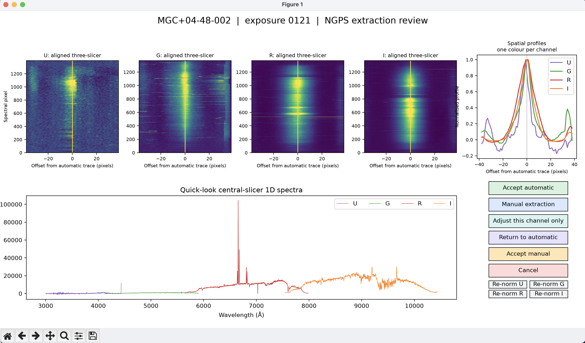
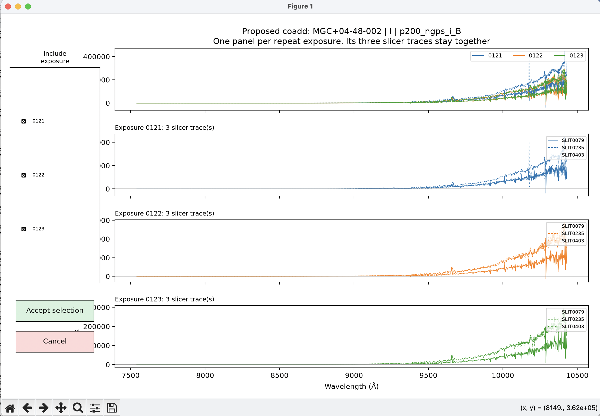

# NGPS / PypeIt reduction workflow

This repository contains the reproducible NGPS reduction scripts. It installs
the pinned NGPS-enabled [PypeIt fork](https://github.com/cfremling/PypeIt)
separately. 
PypeIt is the reduction engine and
[`ngps_pipeline`](https://github.com/alessandropeca/ngps_pipeline) is its
operational wrapper. The official PypeIt project is
[here](https://github.com/pypeit/PypeIt).

## Install once

Choose folders for your own computer before running these commands. The two
paths below are examples, not requirements. Use any locations you prefer and
keep them consistent.

Note: The long strings such as `e9ed85c1a237c49626227f4227e323fc390def4b` are Git
commit IDs: unique labels for the exact tested software version. Do not edit
them during installation.

```bash
export GITHUB_ROOT="$HOME/Documents/GitHub"
export SOFTWARE_ROOT="$HOME/Software"
export WORKFLOW_ROOT="$GITHUB_ROOT/ngps-pypeit-workflow"
mkdir -p "$GITHUB_ROOT" "$SOFTWARE_ROOT"

git clone https://github.com/alessandropeca/ngps-pypeit-workflow.git "$WORKFLOW_ROOT"
cd "$WORKFLOW_ROOT"

conda env create -f environment.yml
conda activate ngps

git clone https://github.com/cfremling/PypeIt.git "$SOFTWARE_ROOT/PypeIt"
git -C "$SOFTWARE_ROOT/PypeIt" checkout e9ed85c1a237c49626227f4227e323fc390def4b
git clone https://github.com/alessandropeca/ngps_pipeline.git "$SOFTWARE_ROOT/ngps_pipeline"
git -C "$SOFTWARE_ROOT/ngps_pipeline" checkout 55fa9491eb1683769006118c46b26963bbf33ea2

python -m pip install -e "$SOFTWARE_ROOT/PypeIt"
python -m pip install -e "$SOFTWARE_ROOT/ngps_pipeline"
python tools/verify_environment.py
```

The final command must report both pinned commits as `OK`.

## Reduction for one night

Set the date and data location:

```bash
conda activate ngps  # if not already active
export WORKFLOW_ROOT="$HOME/Documents/GitHub/ngps-pypeit-workflow"  # your chosen location
cd "$WORKFLOW_ROOT"
export NGPS_WORK_ROOT="$HOME/ngps_data/work"
export DATE=20260623
export NIGHT="$NGPS_WORK_ROOT/$DATE"
```

1. Copy raw FITS files into `$NIGHT/raw/`. Do not modify or split them.

   ```bash
   mkdir -p "$NIGHT/raw"
   rsync -av "/PATH/TO/RAW/FILES/"*.fits "$NIGHT/raw/"
   ```

2. Reduce every valid channel/setup and save an automatic extraction-review PDF
   for every science exposure in the entire night. This does not pause for decisions.
   `--auto` overwrites the existing automatic reduction products and refreshes
   the review PDFs. If you omit `--auto`, a dashboard opens
   for each exposure so you can review and change the automatic settings.

   ```bash
   python scripts/ngps_reduce_all_configs.py "$DATE" --auto
   ```

   The PDFs to inspect are in `$NIGHT/ExtractionQA/<target>/` (for this night:
   `~/ngps_data/work/20260623/ExtractionQA/`). On macOS, open that folder with:

   ```bash
   open "$NIGHT/ExtractionQA"
   ```

   These PDFs are derived science-review products. Each one has four
   aligned U/G/R/I 2D panels, coloured spatial profiles, and a quick-look 1D
   panel.
   The aligned 2D panels are for checking the same source in the three slicers, they are not a science coadd.

3. To revise one already-reduced target whose automatic PDF does not look
   right, open the same dashboard interactively. This is a **single-target,
   single-exposure review command**.
   
   The **Manual extraction** button enables a click in a channel
   panel and links the position across U/G/R/I.

   The **Adjust this channel only** button makes the next click move only the panel selected. The saved PDF is
   replaced with your marked version.
   Manual positions inherit PypeIt's measured FWHM separately for every
   channel/slicer. Therefore, you can change pixel position but not extraction width.

   The **Accept Manual** and **Accept Automatic** buttons run an isolated
   one-exposure PypeIt setup. They replace only that exposure's derived
   `spec1d/spec2d` products (images and files) in the baseline setup.

   The **Return to automatic** button clears the manual aperture and restores the original
   profile and quick-look plots.

   The **Cancel** button, or closing the window, leaves the existing PDF and all PypeIt
   products unchanged.

   The **Re-norm U/G/R/I** buttons set the quick-look y-range from one channel only. This is
   a display aid and does not change the detector counts or extracted spectrum.

   For example, the reviewed PDF for `MGC+04-48-002`, exposure 0121, is saved as
   `~/ngps_data/work/20260623/ExtractionQA/MGC_04-48-002/ngps_extraction_review_0121.pdf`.

   ```bash
   python scripts/ngps_manual_target_extractions.py "$DATE" --target 'MGC+04-48-002' --exposure 0121
   ```

   Example extraction-review window:

   

   Alternatively, omit `--auto` during reduction to open the dashboard for each
   source as soon as the reductions finish:

   ```bash
   python scripts/ngps_reduce_all_configs.py "$DATE"
   ```

   If you accept automatic or manual re-extraction after flux calibration,
   repeat step 4 before coadding.

4. Flux-calibrate the 1D products.

   Build `science_standard_inventory.csv` from the reduced frames.

   ```bash
   python scripts/ngps_inventory_standards.py "$DATE"
   ```

   Create or display `science_standard_associations.csv`. Each row is one
   consecutive group of science exposures with one assigned standard. No
   spectra are changed.

   ```bash
   python scripts/ngps_flux_calibrate.py "$DATE"
   ```

   Create the selected sensitivity functions and flux-calibrate copies in
   `Fluxed/`.

   ```bash
   python scripts/ngps_flux_calibrate.py "$DATE" --run
   ```

   Check that every safe science file has calibrated `FLAM` values. This also
   reports groups skipped because no validated standard is available.

   ```bash
   python scripts/ngps_audit_flux.py "$DATE"
   ```

   Review `$NIGHT/science_standard_associations.csv` before `--run`. The
   automatic proposal assigns one standard to every consecutive exposure of a
   target within each channel and setup. If you prefer another standard, edit
   `standard_filename` in that group row, rerun the dry run to confirm the
   plan, then run the single-line `--run` command above. To discard edits and
   create a new proposal, run `python scripts/ngps_flux_calibrate.py "$DATE" --reset-associations`.

   If a selected standard fails or has an invalid sensitivity function, the run
   finds the nearest validated standard and writes it as an `automatic fallback`.
   It records the fallback and continues automatically. If no validated standard
   exists, it stops that group from being flux-calibrated, moves any old copy to
   `Fluxed_invalid_standard/`, and calibrates the remaining safe groups. The
   terminal identifies the target, channel, and setup. That configuration keeps
   only its reduced counts-level products and has no Fluxed product or coadd.

   During `--run`, every available standard in a channel/setup is compared with
   its known PypeIt reference spectrum. A missing, non-finite, or discrepant
   standard is rejected. If the remaining standard responses disagree by more
   than 1 mag across their central response, that channel/setup is stopped for
   review. Read `$NIGHT/sensitivity_review.csv` before changing an association.

5. Find repeated observations by target name, then review and coadd them.

   This creates `$NIGHT/coadd_review.csv` and prints the reviewable coadds.
   Each row is one target, channel, and setup. Single exposures and groups
   without Fluxed spectra are automatically marked `discard`. Add a note or
   change `status` to `discard` for any observation-log problem before review.

   ```bash
   python scripts/ngps_interactive_coadd.py "$DATE" --list-groups
   ```

   After reviewing `coadd_review.csv`, automatically write and run every
   reviewable coadd. This saves one automatic review PDF per coadd. Existing
   coadd selections and final coadded FITS files are replaced. Review PDFs are saved in
   `$NIGHT/CoaddQA/<target>/`. For example, the R-channel B-setup PDF for
   `MGC+04-48-002` is
   `~/ngps_data/work/20260623/CoaddQA/MGC_04-48-002/MGC_04-48-002_r_p200_ngps_r_B_coadd_review.pdf`.

   ```bash
   python scripts/ngps_interactive_coadd.py "$DATE" --all --auto
   ```

   At the end, a final coadd report lists every completed FITS file with its
   full location, plus any failed or skipped coadds. The same record is saved
   as `$NIGHT/coadd_run_summary.csv`. Audit the complete night later with:

   ```bash
   python scripts/ngps_interactive_coadd.py "$DATE" --audit --all
   ```

   This writes `$NIGHT/coadd_audit.csv` and lists completed final spectra,
   missing outputs, and discarded groups. Audit one target only with:

   ```bash
   python scripts/ngps_interactive_coadd.py "$DATE" --audit --target 'MGC+04-48-002'
   ```

   This writes `$NIGHT/coadd_audit_MGC_04-48-002.csv`.

   To open the review window for every reviewable group, one after another:

   ```bash
   python scripts/ngps_interactive_coadd.py "$DATE" --all
   ```

   The window has one panel per repeat exposure (e.g. 0121, 0122, 0123). Each
   panel contains that exposure’s three NGPS slicer traces. The selection
   buttons include or exclude one whole exposure, keeping its three traces
   together. The **Accept selection** button saves a review PDF, replaces that
   group's selection, and runs its PypeIt coadd. The **Cancel** button, or
   closing the window, writes no selection or coadd product.

   Example coadd-review window:

   

   To work with one target only, open its review window:

   ```bash
   python scripts/ngps_interactive_coadd.py "$DATE" --target 'MGC+04-48-002'
   ```

   After `--all --auto`, use this same command to recheck one target. The
   **Accept selection** button overwrites only that target, channel, and
   setup's review PDF, coadd selection, and final coadded FITS file. Its review PDF is in
   `$NIGHT/CoaddQA/<target>/`, for example
   `~/ngps_data/work/20260623/CoaddQA/MGC_04-48-002/MGC_04-48-002_r_p200_ngps_r_B_coadd_review.pdf`.

   To accept one target’s automatic selection without opening its window:

   ```bash
   python scripts/ngps_interactive_coadd.py "$DATE" --target 'MGC+04-48-002' --auto
   ```

   This writes or replaces the selected coadd files and runs PypeIt immediately.

   To preselect observations for one target:

   ```bash
   python scripts/ngps_interactive_coadd.py "$DATE" --target 'MGC+04-48-002' --channel r --setup p200_ngps_r_B --exposure 0121 --exposure 0123
   ```

6. Save the final U/G/R/I plots for every complete target and configuration.
   This does not open graphic windows. The terminal lists every saved plot and
   reports any channel coadd that cannot be plotted.

   ```bash
   python scripts/ngps_plot_final_spectra.py "$DATE" --all
   ```

   To save one target and open its graphic window, use:

   ```bash
   python scripts/ngps_plot_final_spectra.py "$DATE" --target 'MGC+04-48-002'
   ```

   Close the window when you are finished zooming or panning. The figure has one
   flux-versus-wavelength panel per channel. It does not merge U/G/R/I or alter
   the FITS spectra. Each y-axis includes every valid flux sample. It saves a PDF
   and PNG in `$NIGHT/FinalQA/MGC_04-48-002/`, for example
   `~/ngps_data/work/20260623/FinalQA/MGC_04-48-002/MGC_04-48-002_UGRI_B_coadds.pdf`.
   If a target has more than one complete configuration, choose one explicitly:

   ```bash
   python scripts/ngps_plot_final_spectra.py "$DATE" --target 'NGC4102' --configuration C
   ```

## Additional notes

Three slicer traces belong to one raw exposure. Obs numbers such as 0121, 0122,
and 0123 might be repeated exposures of the same source. Check the observation log.
Coadd repeats within each channel/setup first. Keep the U, G, R, and I products
separate. The current final reproducible product is a reviewed, flux-calibrated
coadd per target/channel/setup.

## Planned extensions

- Reviewed telluric correction after the channel coadds
- Reviewed U/G/R/I merging

For the fuller guide, including background and troubleshooting, see
[NGPS_REDUCTION_GUIDE.md](docs/NGPS_REDUCTION_GUIDE.md).
